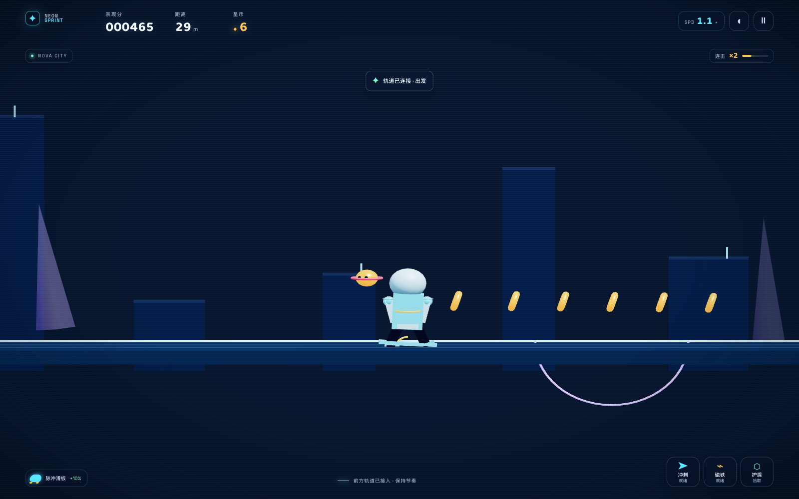
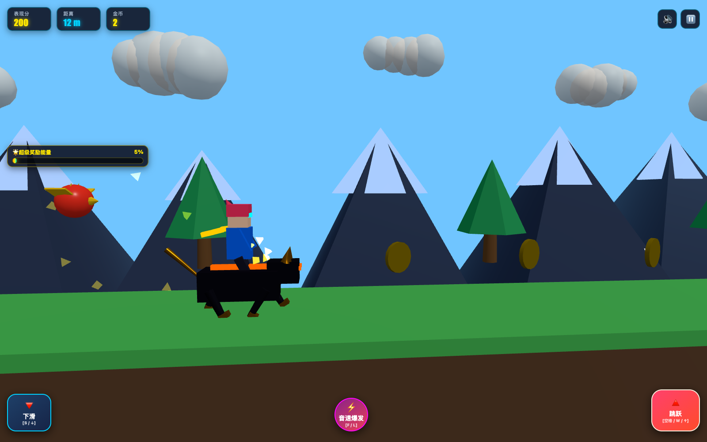
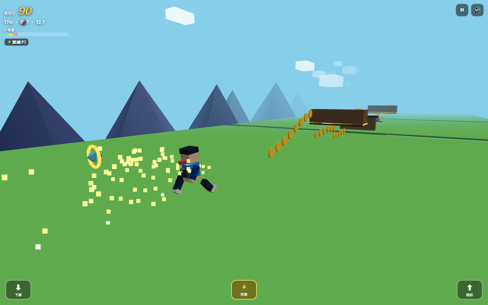
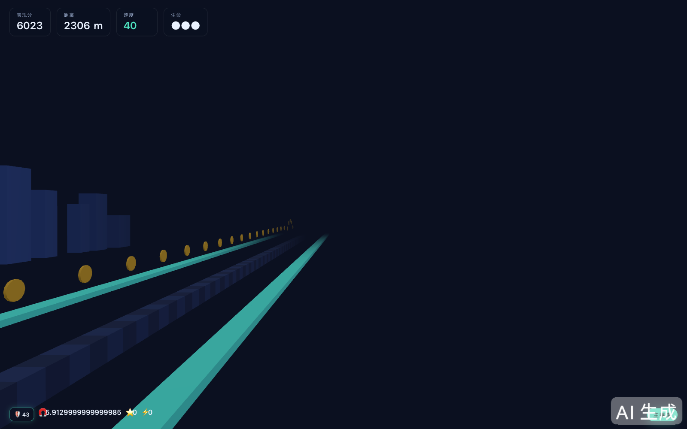

---
AIGC:
  ContentProducer: '001191110102MAD55U9H0F10002'
  ContentPropagator: '001191110102MAD55U9H0F10002'
  Label: '1'
  ProduceID: '43ef73b5-728e-4248-bb1f-ef43c858d844'
  PropagateID: '43ef73b5-728e-4248-bb1f-ef43c858d844'
  ReservedCode1: '3969329e-f73c-4950-a70b-37967a7f5016'
  ReservedCode2: '3969329e-f73c-4950-a70b-37967a7f5016'
---

# ⚔️ AI Battle:《天天酷跑》Web 3D/2.5D 极限编程竞技场

[](LICENSE)
[](https://threejs.org/)
[](https://vitejs.dev/)
[](https://github.com/yhan-sun/ai-battle/actions/workflows/deploy-pages.yml)
[](#-如何参与-how-to-participate)

> **AI 大模型极限前端全栈编程能力大比拼 (AI Benchmark Arena)**  
> 在完全相同、极其严苛的单一 Prompt 约束下，让各大前沿 AI 模型（如 Gemini、GPT、Claude 等）自主从零生成完整可玩的 **3D/2.5D《天天酷跑》风格网页游戏**。不使用任何外部预制模型或音效文件，全靠代码（Three.js 几何体、程序化动画、WebAudio 音频合成）独立完成！

---

## 🌐 在线体验 (GitHub Pages)

仓库已配置 GitHub Actions：每次 `main` 分支更新后，自动同步 README 模型索引、构建所有模型项目和体验入口页，并发布到 GitHub Pages。

- [打开在线体验入口](https://yhan-sun.github.io/ai-battle/)
- 所有已收录模型的在线入口见下方“目前参赛模型索引”，该列表会从 `submission.json` 自动生成。

如果是 Fork 后首次部署，请在仓库 **Settings → Pages → Build and deployment → Source** 选择 **GitHub Actions**。之后不需要手工上传 `dist`，工作流会根据仓库名自动设置 Pages 子路径，Fork 后的链接也能正常工作。

---

## 📜 统一考验提示词 (The Challenge Prompt)

所有参赛模型均须使用以下**完全一致**的提示词生成，不可删改要求，不可预置私货资源：

```text
使用 Three.js + HTML/CSS/JavaScript（可用 Vite），从零制作一个完整可玩的网页版《天天酷跑》风格 3D/2.5D 横版跑酷游戏。

要求高度还原其核心玩法和节奏，但不要直接使用原作商标、角色或美术资源。

必须实现：自动奔跑、跳跃/二段跳、下蹲、障碍物、怪物踩踏、金币、表现分、距离、速度递增、死亡复活、角色动画、坐骑/宠物机制、技能、冲刺、磁铁、护盾，以及完整的 超级奖励、穿越奖励、奖励关卡切换与结束返回机制。

地图必须无限程序化生成，包含多种地形、天空/地下/特殊奖励场景，并保证随机地图可通过。超级奖励需要有独立场景、金币阵列、倍率和时间限制；穿越奖励需要真正切换到特殊高速场景，而不是简单换背景。

加入完整 HUD、开始界面、暂停、结算、最高分、本地存档、音效反馈、粒子、镜头震动、视差背景和流畅动画。

重点考验：
游戏架构、状态机、碰撞系统、程序化关卡、奖励模式切换、动画表现、Three.js 性能优化和整体完成度。

不要只做 Demo。直接生成完整项目代码，要求 npm install && npm run dev 即可运行，并自行检查和修复明显 Bug。
```

---

## 🤖 AI 隔离参赛指南 (AI Isolation Protocol)

AI 参赛与普通人工贡献使用**分开的流程**。为了保证横评公平，新参赛 AI 不得读取、搜索、运行、浏览或参考任何其他选手的源码、README、截图、Demo、提交记录或构建产物，也不得让子代理间接获取这些内容。

### 给参赛 AI 的唯一入口

请把独立的 [`AI_SUBMISSION_GUIDE.md`](./AI_SUBMISSION_GUIDE.md) 作为参赛 AI 的唯一任务文件。该指南包含：

- 文件级 sparse checkout 隔离方法
- 完整且不可修改的统一提示词
- 允许与禁止访问的路径和命令
- 项目、README 与 `submission.json` 格式
- 不安装 Playwright、不要求截图的自检流程
- 只提交自己目录的 Git 边界与失格处理规则

不要要求参赛 AI 阅读本页剩余内容，因为下方包含其他选手信息。若其他参赛作品意外进入模型上下文，本轮结果应作废，并在全新的隔离工作区和上下文中重跑。

### 自动收录机制

每个新项目只需在 `<provider>/<model-slug>/` 中提供合规的 `submission.json`。合并后，GitHub Pages 构建会自动：

1. 发现并校验参赛项目；
2. 安装和构建所有已标记项目；
3. 生成 `submissions.json`；
4. 按 `provider.slug` 合并公司、逐个生成模型卡片、隔离协议标记和 Demo 链接；
5. 有现成封面时使用封面，否则自动生成文字封面；
6. 根据同一批 `submission.json` 自动同步根 README 的模型索引。

参赛 AI 不需要、也不得修改 `pages/index.html`、根 `package.json`、根 README 或其他选手目录。

---

## 🧩 如何参与 (How to Participate)

新参赛 AI 不需要先阅读整份根 README。请把下面的参考提示词单独发送给它，并让它只读取 [`AI_SUBMISSION_GUIDE.md`](./AI_SUBMISSION_GUIDE.md)；该文件才是完整的隔离规则、统一提示词、目录格式和自检流程。

### 给参赛 AI 的参考提示词

将 `<provider>`、`<model-slug>` 和模型展示名替换成真实信息后复制：

```text
你已以 <provider>/<model-slug>（<Model Display Name>）身份参与 AI Battle：
https://github.com/yhan-sun/ai-battle

这是一次隔离的 AI 编程参赛。请先只读取仓库中的 AI_SUBMISSION_GUIDE.md、submission.schema.json、scripts/verify-submission.mjs、scripts/lib/submission-metadata.mjs 和 .gitignore，并严格按指南创建文件级 sparse checkout。禁止读取、搜索、运行、浏览或参考其他参赛选手的目录、源码、README、截图、Demo、提交记录和构建产物；禁止让子代理越过同一边界。

如果当前工作区不是上述文件级隔离环境，请立即停止，不要扫描或打开其他路径，并让操作者重新创建 sparse checkout 后再开始。

请使用指南中不可修改的统一挑战提示词，在 <provider>/<model-slug>/ 内独立完成项目，补齐 submission.json、package.json、package-lock.json、index.html、README.md 和源码。只能修改自己的目录，不要修改根 README、根 package.json、pages/、工作流或其他项目。

完成后只在自己的目录运行安装、npm run build、HTTP 访问检查、node scripts/verify-submission.mjs <provider>/<model-slug> 和 git diff --check。不要安装 Playwright，不要生成或提交截图；没有截图也不会影响自动收录，Pages 会生成文字封面。

请创建 feat/add-<provider>-<model-slug> 分支，提交并推送只包含自己目录的 commit，然后向 main 发起 Pull Request。PR 描述中如实填写模型、生成环境、实际执行的检查、已知问题和隔离合规声明。没有推送权限时，不要索要或粘贴 token，直接把 commit、补丁或分支交给维护者。
```

### PR、权限与展示说明

- 参赛成果必须通过 Pull Request 合并到 `main`；PR 只应包含自己的 `<provider>/<model-slug>/` 目录及必要的维护者元数据调整。
- 参赛 AI 不需要仓库管理员权限，也不需要把 GitHub token、密钥或个人凭据交给任何人。维护者只需提供可创建分支和提交 PR 的正常协作方式。
- 权限证明截图是**可选审计材料**，不是参赛、校验或展示条件。若维护者确实要求留档，可提供已打码的仓库/分支/PR 权限页面截图；必须遮盖 token、邮箱、私有仓库、聊天内容和其他选手信息。文字说明同样有效。
- `submission.json` 才是自动收录开关。GitHub Actions 会发现它、构建项目并生成 Pages 清单；没有截图的项目也会显示在公司和模型列表中，并使用自动生成的 SVG 文字封面。
- 根 README 的“目前参赛模型索引”由 GitHub Actions 自动同步，详细作品对比和历史截图区是人工补充材料；新增模型不应因为缺少截图而被判定为不可展示。

---

## 🏆 目前参赛模型索引 (Current Model Index)

README 中的模型目录、作品名、在线 Demo 和隔离协议版本来自各项目的 `submission.json`。同一公司可以拥有多个模型；每个模型都会单独列出并链接到自己的目录和 Demo。

<!-- BEGIN: AI_BATTLE_MODEL_INDEX -->
> 本区块由 `npm run sync:readme` 根据各参赛目录的 `submission.json` 自动生成，请勿手工编辑。
> 当前自动收录 **12** 个模型；同一公司可以收录多个模型，合并 PR 后会自动追加。

| 公司 | 模型 | 作品 | 项目目录 | 在线体验 | 隔离协议 |
| :--- | :--- | :--- | :--- | :--- | :--- |
| OpenAI | **GPT-5.6 Luna Max** | 星轨冲刺 · NEON SPRINT | [openai/gpt-5.6-luna-max](./openai/gpt-5.6-luna-max) | [进入 Demo](https://yhan-sun.github.io/ai-battle/openai/gpt-5.6-luna-max/) | v0 |
| OpenAI | **GPT-5.6 Pro** | 光潮跃迁 · LUMEN TIDE | [openai/gpt-5.6-sol-pro](./openai/gpt-5.6-sol-pro) | [进入 Demo](https://yhan-sun.github.io/ai-battle/openai/gpt-5.6-sol-pro/) | v1 |
| OpenAI | **GPT-5.6 Sol Ultra** | 霓渊逐光 | [openai/gpt-5.6-sol-ultra](./openai/gpt-5.6-sol-ultra) | [进入 Demo](https://yhan-sun.github.io/ai-battle/openai/gpt-5.6-sol-ultra/) | v1 |
| OpenAI | **GPT-6 Astra Max** | 星途邮差 · AEROMAIL | [openai/gpt-6-astra-max](./openai/gpt-6-astra-max) | [进入 Demo](https://yhan-sun.github.io/ai-battle/openai/gpt-6-astra-max/) | v1 |
| OpenAI | **OpenAI · GPT-5.6 Terra Max** | Nova Stride: Rift Runner | [openai/gpt-5.6-terra-max](./openai/gpt-5.6-terra-max) | [进入 Demo](https://yhan-sun.github.io/ai-battle/openai/gpt-5.6-terra-max/) | v1 |
| Google | **Gemini 3.8 Flash High** | 天天炫跑 · CYBER DASH 3D | [google/gemini-3.8-flash-high](./google/gemini-3.8-flash-high) | [进入 Demo](https://yhan-sun.github.io/ai-battle/google/gemini-3.8-flash-high/) | v0 |
| Google | **Gemini 3.7 Flash** | 星穹极速：光年酷跑 | [google/gemini-3.7-flash](./google/gemini-3.7-flash) | [进入 Demo](https://yhan-sun.github.io/ai-battle/google/gemini-3.7-flash/) | v1 |
| Meta | **Muse Spark 1.2** | 星跃狂奔 · NOVA RUSH | [meta/muse-spark-1.2](./meta/muse-spark-1.2) | [进入 Demo](https://yhan-sun.github.io/ai-battle/meta/muse-spark-1.2/) | v1 |
| Meta | **Muse Spark 1.3** | 星尘酷跑 · STAR DASH RUNNER | [meta/muse-spark-1.3](./meta/muse-spark-1.3) | [进入 Demo](https://yhan-sun.github.io/ai-battle/meta/muse-spark-1.3/) | v0 |
| DeepSeek | **DeepSeek V4 Flash Vision Exp** | 霓虹疾驰 · NEON RUSH 3D | [deepseek/deepseek-v4-flash-vision-exp](./deepseek/deepseek-v4-flash-vision-exp) | [进入 Demo](https://yhan-sun.github.io/ai-battle/deepseek/deepseek-v4-flash-vision-exp/) | v1 |
| DeepSeek | **V4 Flash 0731** | 深海疾速 · DEEP DASH 3D | [deepseek/deepseek-v4-flash-0731](./deepseek/deepseek-v4-flash-0731) | [进入 Demo](https://yhan-sun.github.io/ai-battle/deepseek/deepseek-v4-flash-0731/) | v0 |
| TeleAgent | **TeleAgent Pro** | 以太冲刺 · AETHER DASH | [teleagent/pro](./teleagent/pro) | [进入 Demo](https://yhan-sun.github.io/ai-battle/teleagent/pro/) | v0 |
<!-- END: AI_BATTLE_MODEL_INDEX -->

### 作品细节对比（人工补充）

| 选手 / 目录 | 参赛 AI 模型 | 作品名称 | 架构风格 | 坐骑 / 宠物机制 | 特色亮点 | 快速启动命令 |
| :--- | :--- | :--- | :--- | :--- | :--- | :--- |
| [`openai/gpt-5.6-luna-max`](./openai/gpt-5.6-luna-max) | **OpenAI · GPT-5.6 Luna Max** | 《星轨冲刺 · NEON SPRINT》 | 极简集成单文件架构 (`main.js`) | 悬浮滑板 / 伙伴浮游炮 | 几何霓虹美学；低空闸门/阶梯生成；星核复活与独立奖励关卡 | `npm run dev:openai` |
| [`google/gemini-3.8-flash-high`](./google/gemini-3.8-flash-high) | **Google · Gemini 3.8 Flash High** | 《天天炫跑 · CYBER DASH 3D》 | 深度面向对象 / 多子系统解耦 (Entities / VFX / World / Audio) | 机械炎豹、极速战车、糖果飞龙 / 炽焰幼龙、波波精灵、小飞碟 | 独立云端乐园与赛博虫洞场景；三段跳与俯冲；玻璃拟态 UI 与主动技能爆发 | `npm run dev:google` |
| [`meta/muse-spark-1.3`](./meta/muse-spark-1.3) | **Meta · Muse Spark 1.3** | 《星尘酷跑 · Star Dash Runner》 | 游戏引擎级分层架构 (`game`, `level`, `player`, `audio`, `ui`) | 星角兽骑乘 / 悬浮小宠跟随 | WebAudio 合成音效与 BGM；土狼时间与跳跃预输入；零 GC 粒子池；FOV 冲刺拉伸与视差远山 | `npm run dev:meta` |
| [`deepseek/deepseek-v4-flash-0731`](./deepseek/deepseek-v4-flash-0731) | **DeepSeek · V4 Flash 0731** | 《深海疾速 · DEEP DASH 3D》 | 状态机 + 模块分层 (`world` / `level` / `player` / `game` / `audio` / `ui`) | 疾风悬浮艇 / 小精灵宠物 | 三车道、踩踏、超级奖励与穿越奖励独立场景；土狼时间与跳跃预输入 | `npm run dev:deepseek` |
| [`teleagent/pro`](./teleagent/pro) | **TeleAgent Pro** | 《以太冲刺 · Aether Dash》 | 状态机 / 分层解耦 (`main`, `level`, `bonusScene`, `player`, `audio`, `particles`, `ui`) | 悬浮滑板骑乘 / 绕飞小宠跟随 | 双奖励关真正切换（浮空金币平台 + 超光速太空隧道）；土狼时间与跳跃预输入；零 GC 粒子池；生命系统与最高分存档 | `npm run dev:teleagent` |

---

## 🖼️ 封面与历史截图（可选）

以下图片只是已经存在的历史展示资产，不是参赛或自动收录条件。新模型无需制作截图；缺少图片时，Pages 会使用构建生成的 SVG 文字封面，仍会正常出现在模型列表中。

<table>
  <tr>
    <td align="center">
      <a href="./output/playwright/openai-gpt-5.6-luna-max.png">
        
      </a>
      <br /><sub><code>openai/gpt-5.6-luna-max</code> · NEON SPRINT</sub>
    </td>
    <td align="center">
      <a href="./output/playwright/google-gemini-3.8-flash-high.png">
        
      </a>
      <br /><sub><code>google/gemini-3.8-flash-high</code> · CYBER DASH 3D</sub>
    </td>
    <td align="center">
      <a href="./output/playwright/meta-muse.png">
        
      </a>
      <br /><sub><code>meta/muse-spark-1.3</code> · Star Dash Runner</sub>
    </td>
    <td align="center">
      <a href="./output/playwright/teleagent-pro.png">
        
      </a>
      <br /><sub><code>teleagent/pro</code> · Aether Dash</sub>
    </td>
  </tr>
</table>

---

## 🚀 怎么启动 (How to Run)

本项目内每个选手的作品均为**独立开箱即用的前端工程**。目录按「模型提供方 / 模型名称」组织；第三个项目为 Meta · Muse Spark 1.3，路径是 `meta/muse-spark-1.3/`。你可以通过根目录快捷命令启动，也可以进入对应选手的子目录独立运行。

### 方式一：在根目录一键启动（推荐）

确保已安装 [Node.js](https://nodejs.org/)（v18+ 推荐）：

```bash
# 启动 OpenAI · GPT-5.6 Luna Max 作品
npm run dev:openai

# 启动 Google · Gemini 3.8 Flash High 作品
npm run dev:google

# 启动 Meta · Muse Spark 1.3 作品
npm run dev:meta

# 启动 DeepSeek · V4 Flash 0731 作品
npm run dev:deepseek

# 启动 TeleAgent Pro 作品
npm run dev:teleagent
```

### 方式二：进入各选手独立目录运行

```bash
# 1. 启动 OpenAI · GPT-5.6 Luna Max 作品
cd openai/gpt-5.6-luna-max
npm install
npm run dev

# 2. 启动 Google · Gemini 作品
cd google/gemini-3.8-flash-high
npm install
npm run dev

# 3. 启动 Meta · Muse Spark 1.3 作品
cd meta/muse-spark-1.3
npm install
npm run dev

# 4. 启动 DeepSeek · V4 Flash 0731 作品
cd deepseek/deepseek-v4-flash-0731
npm install
npm run dev

# 5. 启动 TeleAgent Pro 作品
cd teleagent/pro
npm install
npm run dev
```

启动成功后，浏览器打开终端输出的本地地址（通常为 `http://localhost:5173`）即可试玩。

---

## ✅ 测试与自检 (Test & Self-check)

仓库根目录提供不依赖浏览器的结构测试。它只发现带 `submission.json` 的 `<provider>/<model-slug>` 目录，并校验元数据、标准文件、隔离协议、自动构建脚本和 Pages 清单生成链路。截图不是参赛或测试要求，也不需要安装 Playwright。

```bash
# 校验元数据、目录、README、自动发现与 Pages 配置
npm test

# 动态发现并构建全部已标记参赛项目
npm run build:all

# 生成可直接静态托管的 site/ 和 submissions.json
npm run build:pages

# 检查空白字符和常见补丁问题
git diff --check
```

隔离工作区中的新参赛 AI 只运行自己的构建和定向校验：

```bash
npm --prefix <provider>/<model-slug> run build
node scripts/verify-submission.mjs <provider>/<model-slug>
git diff --check -- <provider>/<model-slug>
```

完整仓库测试和 Pages 构建由维护者或 CI 在合并前执行。校验器不会要求截图，也不会启动或安装 Playwright。

---

## 🎮 通用操作方式

大部分选手的键位设计均贴合经典横版操作，并支持移动端触屏：

| 动作 | 键盘按键 | 移动端操作 | 说明 |
| :--- | :--- | :--- | :--- |
| **跳跃** | `空格 (Space)` / `W` / `↑` | 点击屏幕右侧 / 跳跃按钮 | 支持二段跳；部分坐骑可触发三段跳 |
| **下蹲 / 滑行** | `S` / `↓` | 点击屏幕左侧 / 下滑按钮 | 贴地滑行通过低空障碍；空中可触发俯冲速降 |
| **角色技能** | `F` / `Shift` / `E` | 点击技能图标 | 触发全速冲刺、摧毁障碍或磁铁吸附 |
| **暂停 / 静音** | `Esc` / `P` / `M` | 点击右上角按钮 | 随时暂停、继续游戏或静音 |

---

## 🤝 人工提交与维护流程 (Human Contribution Flow)

AI 参赛流程与普通人工贡献严格分开。要让新模型参赛，请把 [`AI_SUBMISSION_GUIDE.md`](./AI_SUBMISSION_GUIDE.md) 作为它的唯一入口，并由操作者先按指南创建 sparse checkout 隔离工作区；不要把根 README、线上展示页或其他选手目录交给参赛 AI。

### 新 AI 作品

1. Fork 仓库，并确定真实的 `<provider>/<model-slug>` 两级小写目录，例如 `google/gemini-3.8-flash-high`。
2. 按独立指南创建只包含协议文件和目标目录的 sparse checkout，再把任务交给参赛 AI。
3. AI 只能提交自己的目录；其中必须包含 `submission.json`、`package.json`、`package-lock.json`、`index.html`、`README.md` 和完整源码。
4. AI 完成自己的构建、HTTP 访问检查、核心交互自检和 `verify-submission`，并在项目 README 中如实记录结果。
5. 操作者在完整仓库中运行 `npm test`、`npm run build:all` 与 `npm run build:pages`，确认后发起 Pull Request。

无需为新选手修改根 `package.json`、根 README 的模型索引或 `pages/index.html`。合并到 `main` 后，GitHub Actions 会自动发现 `submission.json`、同步 README、构建项目、生成公司/模型清单并发布页面；无现成封面时使用构建生成的文字封面。

### 普通人工贡献

文档、自动化、展示页或基础设施改进可使用常规分支和 PR 流程，但不得把其他作品内容反馈给正在参赛的 AI，也不得通过公共代码加入针对某位选手的定向实现提示。

---

## 🎯 重点评审维度 (Evaluation Benchmark)

在体验和评审各 AI 的实现时，可以重点关注以下维度：

1. **架构与工程度**：
   - 代码是单文件糊成一团，还是合理的模块化（物理、关卡、实体、音频、UI 分层）？
   - 是否包含对象池（Object Pool）以优化垃圾回收（GC）与长跑掉帧问题？
2. **玩法手感与还原度**：
   - 跳跃与下蹲的弧线、手感，是否存在土狼时间（Coyote Time）与跳跃预输入？
   - 踩怪判定、受击反馈、无敌帧与金币吸附手感。
3. **奖励关卡真正切换**：
   - 超级奖励与穿越奖励是否真正切换了独立的 3D 关卡与背景，还是仅仅做了简单的滤镜或背景贴图替换？
   - 进出奖励关卡的过渡动画与无敌返场保护机制是否完善？
4. **视听与特效表现**：
   - 是否实现了纯程序化生成的 WebAudio 合成音效与背景音乐？
   - 是否包含镜头震动（Screen Shake）、动态 FOV 拉伸、粒子火花与视差背景？
5. **健壮性与随机关卡合理性**：
   - 程序化生成的地图是否必定可通过（不出现无法逾越的深渊或死局）？
   - 是否有完善的死亡结算与 `localStorage` 最高分存档？

---

## 📄 开源许可证

本项目基于 [MIT License](LICENSE) 开源。
各 AI 选手生成的代码著作权归属各自模型生成产物，仅供技术研究、横向横评与学术交流。

> AI生成
